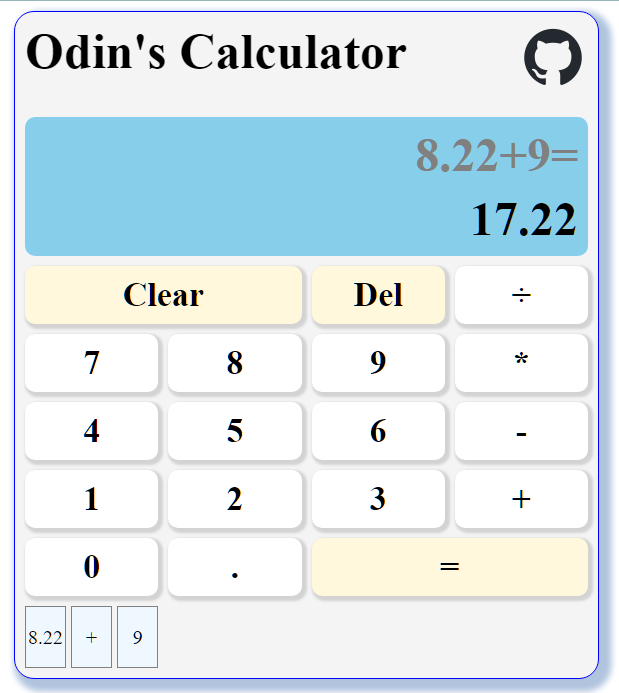

# Project: Calculator - The Odin Project

    

<h2 align="center">
<a href="https://lixoten.github.io/calculator-odin/">DEMO</a>
</h2> 

## Project Overview
A simple yet powerful calculator built with HTML, CSS, and JavaScript, designed to showcase basic calculator functionalities and improve coding skills.

Odin's Calculator is a web-based application that performs basic arithmetic operations such as addition, subtraction, multiplication, division, and handling decimals. It's designed to be intuitive and easy to use.

## Curriculum and Topics Explored

- **Front-End Development**: Building the user interface using HTML, CSS, and JavaScript.
- **Responsive Design**: Creating a layout that is responsive.
- **Event Handling**: Managing user events such as clicks and keyboard events.
- **CSS Grids**

### Project Specification
[Project: Calculator](https://www.theodinproject.com/lessons/foundations-calculator)

### Notes

Ideas and things we can go to improve
* Features
    * Add +/- button
* Refactor code to eliminate duplication. I have some

